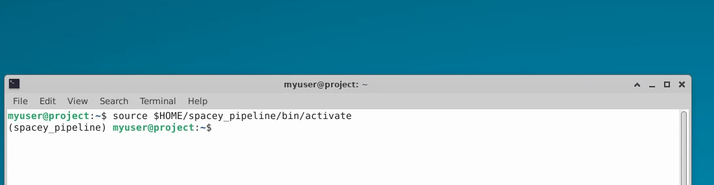
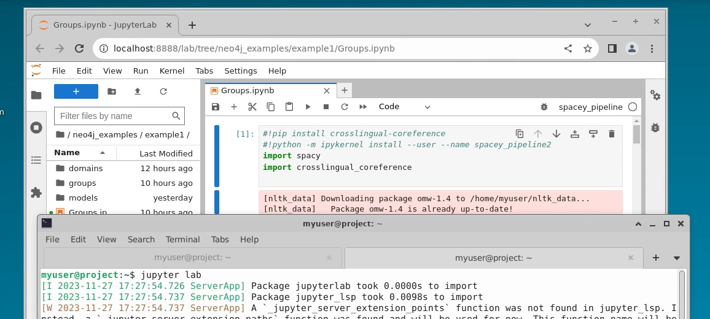
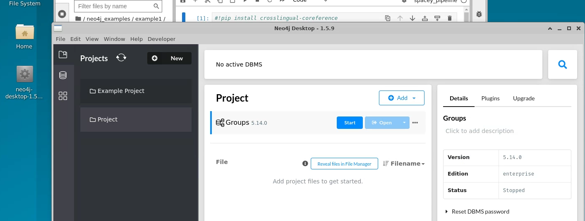
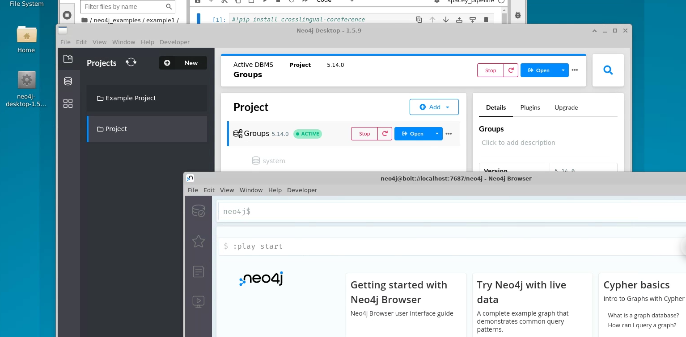
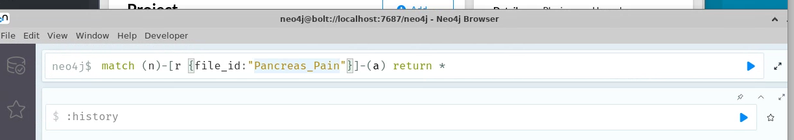
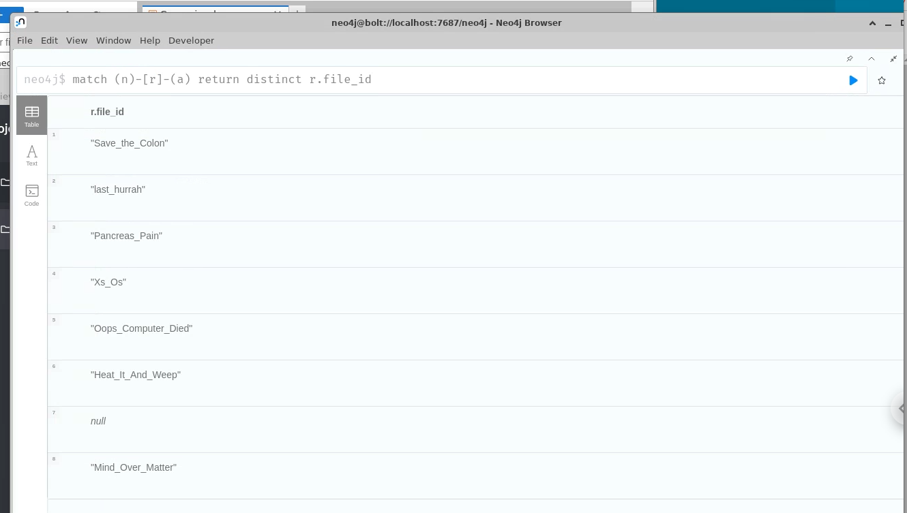

# Creating a distributed computing pipeline for knowledge graph generation

## Preamble

This project description should be read with three teams in mind that
are all part of the same biotech company. The three teams are domain
experts (BIO 441), bioinformaticians and data scientists (CSC 448), and
data engineering (CSC 369).

## Background

You and your team are tasked with taking an ad-hoc Jupyter notebook
pipeline that was designed by your data science team (CSC 448). It has
the basic functionality, but it is written in Jupyter notebook style
that is not good for versioning. It is also written for a single
machine, and your company wants the pipeline to be distributed to their
Ray cluster. Your job is to complete the following objectives. The
manner in which you complete these objectives is up to your team, but
you must justify your solutions and demonstrate that they satisfy the
objectives.

## Objectives

1.  A Python package that can be imported and used to generate a
    > knowledge graph. You may assume that the docker container you are
    > running in has all the dependencies, but you must organize the
    > code into reasonable structure within the module. You must include
    > instructions for how to run and install the package.

2.  Package must scale to a Ray cluster and take advantage of multiple
    > cpus in an efficient manner. You cannot rely on all of the
    > documents being the same length. i.e., you cannot simply put the
    > entire script on each node. You must fully document and explain
    > your approach. You must demonstrate that it is using the resources
    > efficiently.

3.  You must minimize the data being sent to the compute nodes. i.e., we
    > need to bring the compute to the data and not the other way
    > around. We will discuss this in class and work together to come up
    > with a solution.

4.  You must also customize the pipeline in some manner with a different
    > model and then do a comparison of how this affects your
    > distributed system. It could be you extract relations using a
    > different model. Use a larger model. Use a different model for
    > coreference resolution, etc. The objective here is to have a
    > comparison and discuss how your system behaves when it is changed.

## Deliverables

-   Report that details your approach, findings, results, and analysis.
    > It must be a technical report that is well formatted, organized,
    > and contains figures and code snippets when appropriate. It will
    > be graded 0%, 50%, 75%, or 100%. To receive a 100%, you must
    > submit a well written technical document. You can receive 75% by
    > submitting a technical document that satisfies the objectives but
    > it is not well written and organized. You can receive a 50% by
    > submitting a report that meets some but not all of the objectives.

-   Presentation (slide based) 10-15 minutes that presents your project.

## Technical Notes

-   There is a virtual environment created on the machine called
    > spacey_pipeline. It can be activated by typing:\
    > {width="6.5in"
    > height="1.6805555555555556in"}

-   You can start Jupyter by typing:\
    > {width="6.5in"
    > height="2.9305555555555554in"}

-   You can start Neo4j which already contains a database that has
    > processed abstracts from each group (double click the program on
    > the desktop. It takes a minute to start):\
    > {width="6.5in"
    > height="2.4583333333333335in"}

-   Start it by clicking the start button and then you can ignore the
    > DBMS security alert. If you want to use the Neo4j program for any
    > reason, then you'll have to re-enable security. Bloom is not
    > necessary though, but it is a program that can be used to create
    > good visuals.

-   You can open up the browser by clicking Open:\
    > {width="6.5in"
    > height="3.2083333333333335in"}

-   You can view the graph for a particular group by filtering on the
    > relation like the following example that views the graph for
    > Pancreas_Pain group:\
    > {width="6.5in"
    > height="1.1527777777777777in"}

-   If you want a list of all the groups, you can do the following:\
    > {width="6.5in"
    > height="3.6805555555555554in"}
